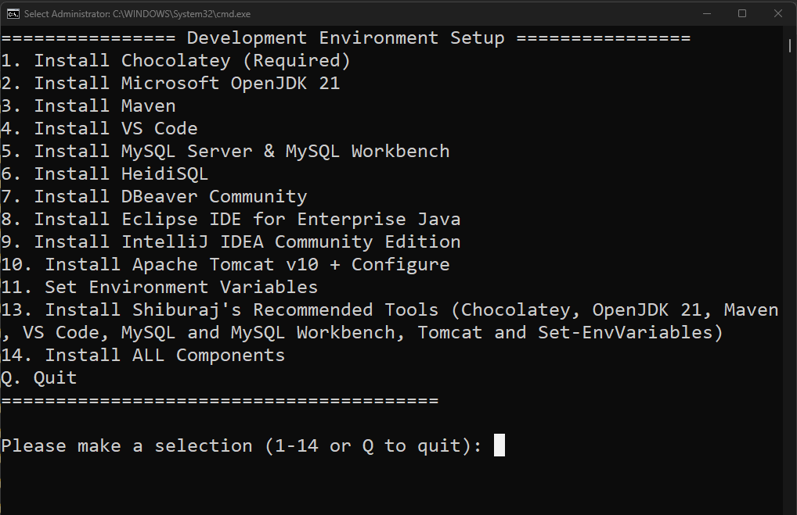

# Guide to Manually Setup JAVA Dev Environment

## Install JAVAJDK
`Java JDK` is required to compile and run Java codes.

1. Download JavaJDK from [OracleJDK](https://www.oracle.com/in/java/technologies/downloads/) or [OpenJDK](https://learn.microsoft.com/en-us/java/openjdk/download). (Install Version 21)
2. Run the Setup and Install Java. While installing note down the location of the Java Installation.
3. Usually its installed at `C:\Program Files\Java\jdk-21`. So we have to setup environment variables properly so that JAVA Installation can be found by other tools. Press `Win + R`, type `sysdm.cpl`, press `Enter`. Go to `Advanced` → `Environment Variables`. Under `System Variables` create a new variable `JAVA_HOME` with the value `C:\Program Files\Java\jdk-21`. Then Under `System Variables` open the `Path` variable and add new entry for `%JAVA_HOME%\bin`.
4. Open `Command Prompt` and check if `javac -version` and `java -version` commands gives you the version of installed JAVA.

5. Complete !!!

## Install Maven
Maven is a build automation and project management tool used mainly for Java projects.

1. Download Maven binaries - [Download](https://maven.apache.org/download.cgi)
2. Extract the `apache-maven-3.9.11-bin.zip` and copy the folder `apache-maven-3.9.11` to `C:\Program Files\Java\`. Please note that the name of the folder maybe different based on which version you have downloaded. 
3. Setup Environment variables assuming maven is stored in `C:\Program Files\Java\apache-maven-3.9.11`.  Press `Win + R`, type `sysdm.cpl`, press `Enter`. Go to `Advanced` → `Environment Variables`. Under System Variables, click New. Variable name `MAVEN_HOME` with value `C:\Program Files\Java\apache-maven-3.9.11`. Then Under `System Variables` open the `Path` variable and add new entry for `%MAVEN_HOME%\bin`. 
4. Open `Command Prompt` and check if `mvn -version` command gives you the version of installed maven.

5. Complete !!!

## Install VSCODE + Extensions
Popular IDE for writing code

1. Download VSCODE - [Download](https://code.visualstudio.com/download#). Download System Installer
2. Run the setup and install
3. Open Vscode and Install following extensions for Java Development
   - `vscjava.vscode-java-pack` → Java Extension Pack
   - `redhat.vscode-community-server-connector` → Community Server Connectors
4. **To add the TomCat Server** : Under `Servers` section in File Explorer sidebar right click on the `Community Server Connector` and `Start/Connect to RSP Provider`. Right click again on `Community Server Connector` and `Create New Server`. From the Popup menu on the top select `Yes` when it asks `Download Server?`. Select `Apache Tomcat 10.1.23`. Accept the license and the download will begin.
5. Setup Complete !!!

## Install MySQL Server
MySQL server is required to work with JDBC.

1. Download and Install [MySQL](https://dev.mysql.com/downloads/mysql/)
2. Default Username: `root` and Password: `blank password`

## Install HeidiSQL/ Workbench
Databse browser is used to manage the database tables and records efficiently.

1. Download and Install [HeidiSQL](https://www.heidisql.com/download.php) or [MySQL Workbench](https://dev.mysql.com/downloads/workbench/)
2. Create a new connection to the database and start using.

**NOTE**: MySQL server must be running. Press `Win + R` and type `services.msc` and Check Mysql Server is running and start mysql server if not yet started.

---

# One Click Setup to Automatically Setup Java Dev Environment

## Steps to Install JAVA Dev Environment with all required tools 

1. Download the Repo to your PC
2. Extract the Zip
3. Double click the `Setup.bat` file to run the script
4. Select appropriate option as per your choice.

5. Enter Option `13` to install all the tools Recommended by Me

**NOTE**: For any software to be installed Option 1 is required